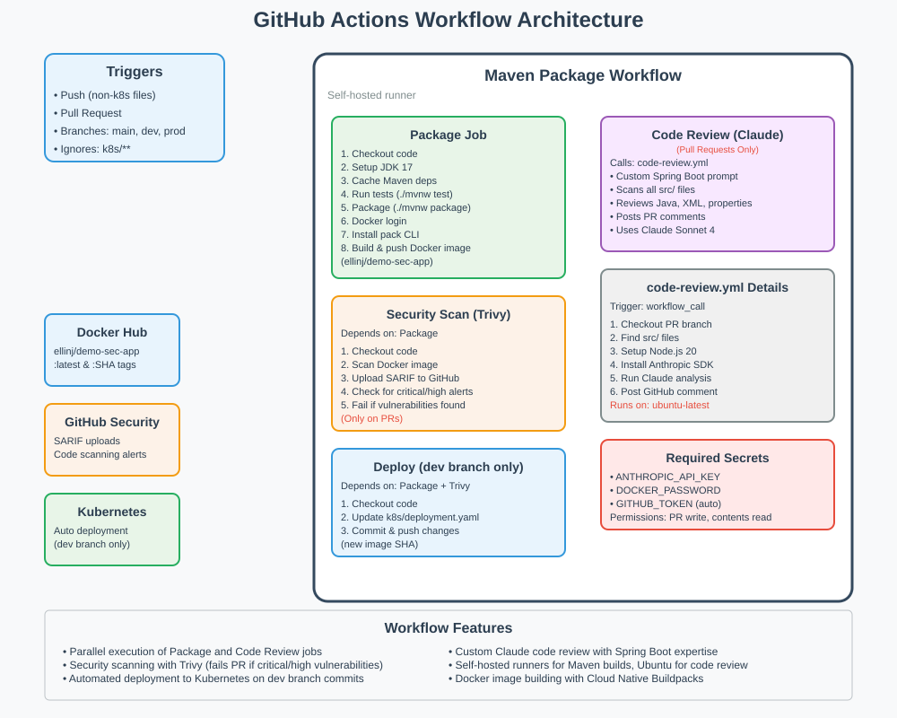

# Web EKS Kubernetes Automation

This repository contains a Spring Boot application with automated CI/CD workflows for building, testing, security scanning, and deployment to Kubernetes.

## Workflow Architecture

## Features

- **Automated Maven builds** with JDK 17 and dependency caching
- **Security scanning** with Trivy vulnerability scanner
- **Code review** using Claude AI for Spring Boot best practices
- **Automated deployment** to Kubernetes on dev branch commits
- **Docker image building** with Cloud Native Buildpacks
- **Parallel execution** of build and code review jobs

## Workflow Triggers

- Push events (excluding k8s/ directory changes)
- Pull requests to main, dev, and prod branches

## Jobs

### Package Job
- Runs tests and builds the application
- Creates and pushes Docker images to Docker Hub
- Uses self-hosted runners

### Security Scan (Trivy)
- Scans Docker images for vulnerabilities
- Uploads SARIF results to GitHub Security tab
- Fails PRs if critical/high vulnerabilities are found

### Code Review (Claude)
- **Only runs on Pull Requests**
- Provides AI-powered code review with Spring Boot expertise
- Reviews Java, XML, and properties files
- Posts feedback as PR comments

### Deploy (Dev Branch Only)
- Updates Kubernetes deployment with new image SHA
- Automatically commits changes back to repository

## Required Secrets

- `ANTHROPIC_API_KEY` - For Claude code review
- `DOCKER_PASSWORD` - For Docker Hub authentication
- `GITHUB_TOKEN` - Automatically provided by GitHub

## File Structure

- `.github/workflows/maven.yml` - Main CI/CD workflow
- `.github/workflows/code-review.yml` - Reusable code review workflow
- `k8s/` - Kubernetes deployment files
- `src/` - Spring Boot application source code
